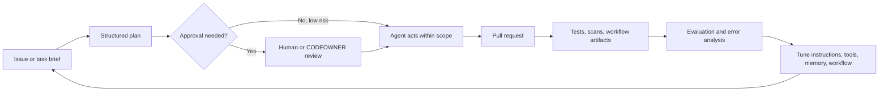
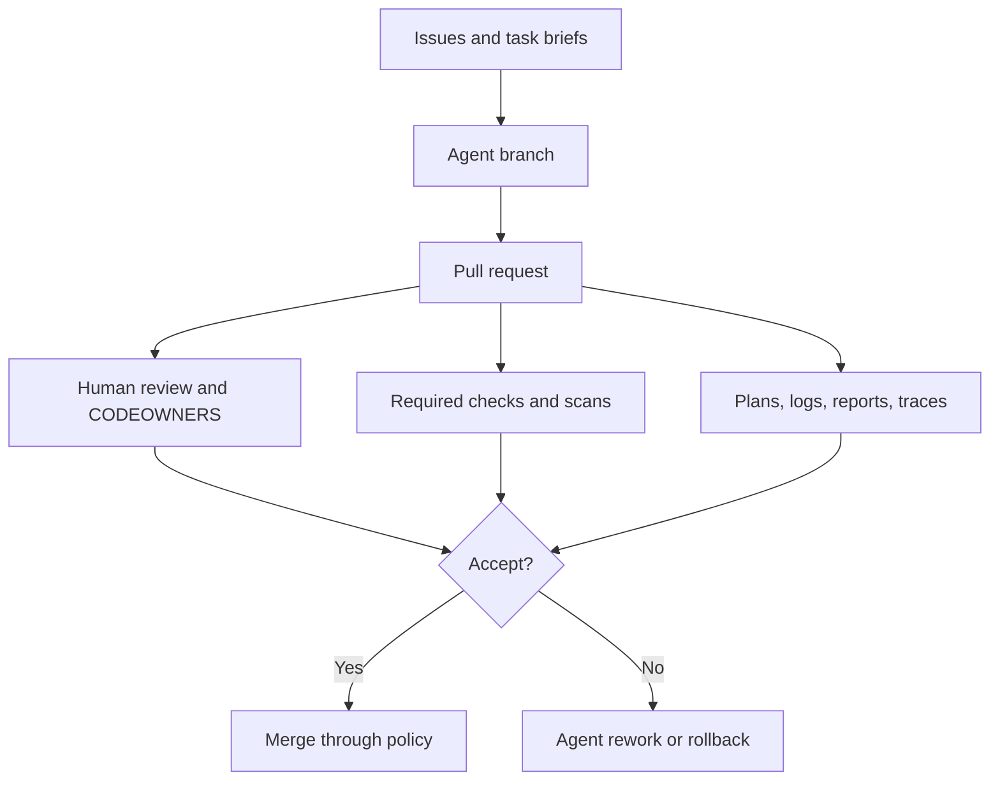
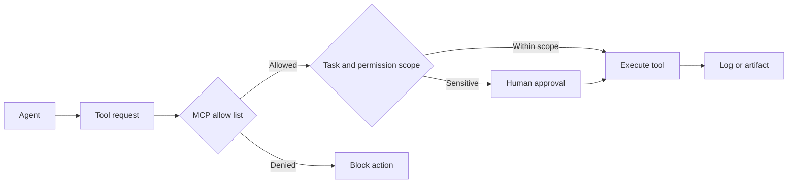
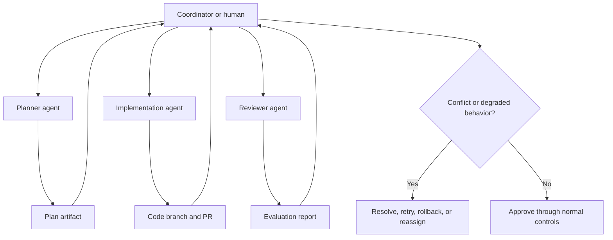
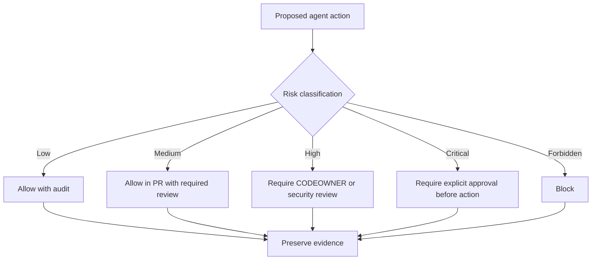

# GH-600 Concept Diagrams

## Plan, act, evaluate lifecycle

## GitHub as system of record and control plane

## MCP tool permission flow

## Multi-agent coordination

## Guardrail approval path

